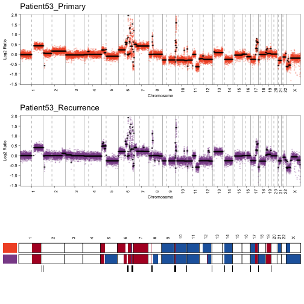
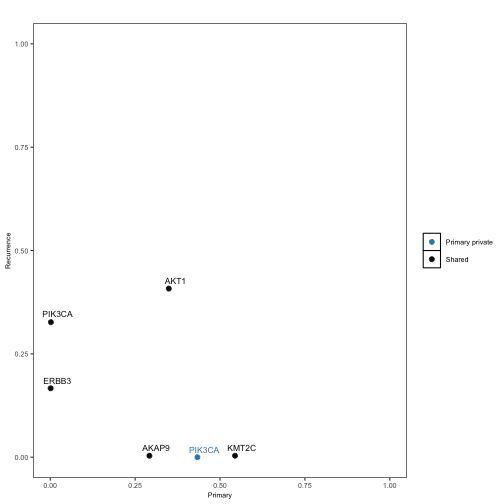
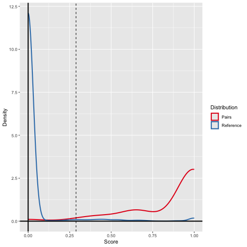
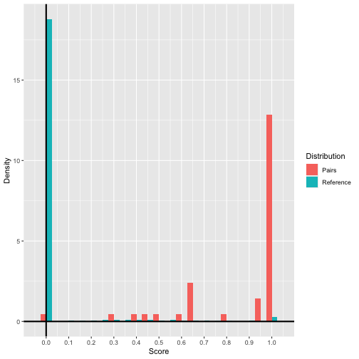

# Introduction 

When a cancer patient develops a new tumor, it's crucial to determine whether the new tumor is a recurrence (metastasis) of the original cancer or a completely new instance of the disease. Since each tumor carries a unique profile of somatic genomic alterations, it is theoretically possible to provide a more definitive diagnosis in these difficult cases by comparing the genomic patterns of the two tumors.

`breakclone` explores the genomic similarity and clonal relationship between pairs of tumor samples by comparing their genomic profiles, using either copy number or mutation data. Unlike other tools (ref), breakclone incorporates both population-level allele frequencies and sample-specific allele frequencies when analyzing mutation data to assess clonal relatedness. For copy number data, it focuses on individual copy number aberration breakpoints, rather than chromosome-arm-level events, to establish clonal connections. This approach is corrected for the frequency of such events within the cohort. Although this method can be more challenging to apply across cohorts analyzed using different techniques, it provides stronger evidence of clonal relationships when shared breakpoints are found between lesions. A reference distribution of concordance scores is generated by randomly permuting pairs of tumors from different patients. The number of permutations is determined empirically to ensure convergence of the distribution and is used to calculate the p-values for the concordance score of each tumor pair.


## Citation

If you find this tool useful, please cite:

------------------------------------------------------------------------

***Lips EH, Kumar T, Megalios A, et al. 2022. Genomic analysis defines clonal relationships of ductal carcinoma in situ and recurrent invasive breast cancer. [Nature Genetics](https://doi.org/10.1038/s41588-022-01082-3)***

------------------------------------------------------------------------

# Installation


``` r
if (!require("devtools"))
    install.packages("devtools")

devtools::install_github("Sawyer-s-Group/breakclone")
```


# Overview of the package

`breakclone` functions can be categorized into mainly Reading, Visualization and Analysis modules. breakclone can be run in three modes depending on your data: `alleleSpecific` for the allele-specific copy number data, `VCF` for the non-allele specific copy number data and **mutation** data. Each of these functions and a short description is summarized as shown below. 


We load the package and the datasets that will be used in this vignette:


``` r
library(breakclone)
data(segmentTable_AS)
data(segmentTable)
data(mutationTable)
```

# Preparing input data

`breakclone` takes advantage of fast `data.table` objects, an extension of `data.frame` objects which allows fast aggregation of large data. If you prefer to use alternative methods to read your data than the proposed by the package, please make sure you transform it to the appropiate formate using `data.table::as.data.table()`.

Minimal inputs for running brekclone are:

- Aberrations `data.table`  (called `segmentTable` in copy number functions and `mutationTable`).
- paired IDs `data.table` (`pairs`). 
plotCNpairVCF
## `segmentaTable` input for non-allele-specific data 

`readVCFCn` automatically reads copy number data from standard VCF files. 


``` r
segmentTable <- readVCFCn("/path/to/data")
```


``` r
class(segmentTable)
#> [1] "data.table" "data.frame"
head(segmentTable)
#>             SampleID    Chr     Start       End  Bins SVType    Length
#>               <char> <char>     <int>    <char> <int> <char>     <int>
#> 1: Patient53_Primary      1 143600001 248900000   955    DUP 105300000
#> 2: Patient53_Primary      2  11500001  12600000    11    DEL   1100000
#> 3: Patient53_Primary      5    100001  50400000   292    DUP  50300000
#> 4: Patient53_Primary      6    400001  94800000   861    DUP  94400000
#> 5: Patient53_Primary      6 101800001 107200000    35    DUP   5400000
#> 6: Patient53_Primary      6 118800001 121300000    25    DUP   2500000
```

## `segmentTable` input for allele-specific data

`readAlleleSpecific` automatically reads text files with columns for sample IDs, chromosome, start, end, number of probes, number of copies in the major and minor allele.


``` r
segmentTable_AS <- readAlleleSpecific("/path/to/data")
```


``` r
class(segmentTable_AS)
#> [1] "data.table" "data.frame"
head(segmentTable_AS)
#>            SampleID    Chr     Start       End nProbes nMajor nMinor
#>              <char> <char>     <int>     <int>   <int>  <int>  <int>
#> 1: Patient1_Primary      1    752566  93527769    9705      4      2
#> 2: Patient1_Primary      1  93544629 249202755   10663      4      1
#> 3: Patient1_Primary      2     72184 170303507   15365      3      2
#> 4: Patient1_Primary      2 170305273 170981375      82      4      2
#> 5: Patient1_Primary      2 170996360 171873033     139      3      2
#> 6: Patient1_Primary      2 171893117 175957888     526      4      2
```

## `mutationTable` input

`readVCFMutations` automatically reads mutations from standard VCF files. It is recommended to include annotation for visualization purposes.


``` r
mutationTable <- readVCFMutations("/path/to/data")
```


``` r
class(mutationTable)
#> [1] "data.table" "data.frame"
head(mutationTable)
#>             SampleID    Chr       Pos     AF annotation
#>               <char> <char>     <int>  <num>     <char>
#> 1: Patient43_Primary     17   7674230 0.4489       TP53
#> 2: Patient35_Primary     17   7675088 0.3202       TP53
#> 3: Patient47_Primary     17   7675088 0.9669       TP53
#> 4: Patient46_Primary      3 179218303 0.4335     PIK3CA
#> 5: Patient32_Primary      3 179218303 0.6620     PIK3CA
#> 6: Patient38_Primary      3 179218303 0.6518     PIK3CA
```

## `pairs` input

`pairs` is a table of paired samples from the dataset. All tumours present in this table will be paired with all tumours from other patients. IIf sample IDs comprise a patient ID and a tumour type identifier, `inferPairs` can attempt to infer the tumour pairs from the cohort. 


``` r
pairs_cn <- inferPairs(segmentTable)
pairs_cnAS <- inferPairs(segmentTable_AS)
pairs_muts <- inferPairs(mutationTable)
head(pairs_muts)
#>             Sample1              Sample2
#> 1 Patient43_Primary Patient43_Recurrence
#> 2 Patient35_Primary Patient35_Recurrence
#> 3 Patient47_Primary Patient47_Recurrence
#> 4 Patient46_Primary Patient46_Recurrence
#> 5 Patient32_Primary Patient32_Recurrence
#> 6 Patient38_Primary Patient38_Recurrence
```

# Clonality assessment using copy number  

Firstly, `breakclone` generates the reference distribution of concordance scores from unpaired tumours for a given dataset. As distribution of concordance scores is calculated by randomly permuting all possible pairs from different patients, we set a seed to be able to reproduce the results of this vignette.


``` r
set.seed(111)
reference <- makeReferenceCN(segmentTable=segmentTable, 
                             pairs=pairs_cn, 
                             cnType='VCF')
#> Making reference based on 210 possible pairs, this might take a while
```

We are ready to run the clonality assessment using `calculateRelatednessCn` which calculates the relatedness scores and p-values for paired tumours from copy number data. Clonality results of copy number data can be summarized using `summarizeClonalityCN`. By default, threshold for ambiguous clonality is 0.05 and for related is 0.01. 


``` r
results <- calculateRelatednessCn(segmentTable=segmentTable, 
                                  pairs=pairs_cn, 
                                  reference=reference, 
                                  cnType='VCF')

summary <- summarizeClonalityCN(clonalityResults=results, 
                                segmentTable, 
                                thres_ambiguous=0.05, 
                                thres_related=0.01, 
                                cnType='VCF')

head(summary)
#>             Sample1              Sample2 pair_scores    pair_ps verdict shared private_sample1 private_sample2 total
#> 1 Patient53_Primary Patient53_Recurrence   0.5329502 0.00000000 Related     56              18              44   118
#> 2 Patient59_Primary Patient59_Recurrence   0.6794118 0.00000000 Related     30               2               6    38
#> 3 Patient47_Primary Patient47_Recurrence   0.2107527 0.00000000 Related      9               9              35    53
#> 4 Patient49_Primary Patient49_Recurrence   0.1289377 0.00952381 Related     15              93              59   167
#> 5 Patient52_Primary Patient52_Recurrence   0.5680412 0.00000000 Related     69              23              33   125
#> 6 Patient57_Primary Patient57_Recurrence   0.5182456 0.00000000 Related     60              18              52   130
#>   fraction_private_sample1 fraction_private_sample2 fraction_shared
#> 1               0.15254237                0.3728814      0.47457627
#> 2               0.05263158                0.1578947      0.78947368
#> 3               0.16981132                0.6603774      0.16981132
#> 4               0.55688623                0.3532934      0.08982036
#> 5               0.18400000                0.2640000      0.55200000
#> 6               0.13846154                0.4000000      0.46153846
```

The algorithm uses the position of the individual copy number aberration breakpoints. Concordant breakpoints can be exported using `getSharedBreaks`. Output is a list of tables including he shared breakpoints per sample.


``` r
breaks <- getSharedBreaks(segmentTable=segmentTable, 
                          pairs=pairs_cn, 
                          cnType="VCF", 
                          save=FALSE)
breaks[[1]]
#>         seqnames     start       end break_shared
#> DUP.1          5    100001  50400000        start
#> DUP.2          6 118800001 121300000        start
#> DUP.3          6 121300001 122100000        start
#> DUP.4          6 122100001 124000000        start
#> DUP.5          6 124000001 130200000        start
#> DUP.6          6 130200001 151200000        start
#> DUP.7          6 151200001 152300000        start
#> DUP.8          6 161100001 163200000        start
#> DUP.9          6 166400001 167500000        start
#> DUP.10         7    100001 159300000        start
#> DUP.11         8  35700001  36500000        start
#> DUP.12         8  39600001  43900000        start
#> DUP.13        10   1000001   1900000        start
#> DUP.14        10   5200001   9300000        start
#> DUP.15        10   9300001  14200000        start
#> DUP.16        10 129100001 133600000        start
#> DUP.17        17  56400001  83200000        start
#> DEL.1          2  11500001  12600000        start
#> DEL.2          6 165400001 166400000        start
#> DEL.3          9    200001 138200000        start
#> DEL.4         10   3900001   5200000        start
#> DEL.5         10  17100001 129100000        start
#> DEL.6         11    200001 134900000        start
#> DEL.7         14  20000001 106900000        start
#> DEL.8         17    600001  55100000        start
#> DEL.9         18    200001  12100000        start
#> DEL.10        21  14000001  46600000        start
#> DEL.11         X   2800001  48500000        start
#> DUP.19         1 143600001 248900000          end
#> DUP.21         6 101800001 107200000          end
#> DUP.31         6 118800001 121300000          end
#> DUP.41         6 121300001 122100000          end
#> DUP.51         6 122100001 124000000          end
#> DUP.61         6 124000001 130200000          end
#> DUP.71         6 130200001 151200000          end
#> DUP.81         6 151200001 152300000          end
#> DUP.91         6 166400001 167500000          end
#> DUP.101        7    100001 159300000          end
#> DUP.111        8  36500001  39300000          end
#> DUP.121        8  39600001  43900000          end
#> DUP.131       10   1000001   1900000          end
#> DUP.141       10   5200001   9300000          end
#> DUP.151       10   9300001  14200000          end
#> DUP.161       10 129100001 133600000          end
#> DUP.171       17  56400001  83200000          end
#> DUP.18        19  16900001  58500000          end
#> DEL.12         2  11500001  12600000          end
#> DEL.21         6 154100001 161100000          end
#> DEL.31         6 165400001 166400000          end
#> DEL.41         9    200001 138200000          end
#> DEL.51        10   3900001   5200000          end
#> DEL.61        10  17100001 129100000          end
#> DEL.71        11    200001 134900000          end
#> DEL.81        12  37400001 133200000          end
#> DEL.91        14  20000001 106900000          end
#> DEL.101       17    600001  55100000          end
```

Paired copy number profiles with shared CNAs and breakpoints can be visualized using `plotCNpairVCF`. Input is binned copy number data where  `cnTable` represents the copy number values and `binnedTable` represents the segment mean of the copy number values.


``` r
data(binnedTable)
data(cnTable)

plotCNpairVCF(binnedTable, 
              cnTable, 
              pair=c('Patient53_Primary', 'Patient53_Recurrence'), 
              segmentTable=segmentTable, 
              breaks=breaks, 
              build='hg38')
#> Warning: Removed 30 rows containing missing values or values outside the scale range (`geom_point()`).
#> Warning: Removed 16 rows containing missing values or values outside the scale range (`geom_point()`).
#> Warning: Removed 25 rows containing missing values or values outside the scale range (`geom_point()`).
#> Warning: Removed 16 rows containing missing values or values outside the scale range (`geom_point()`).
```



# Clonality assessment using allele-specific copy number  


``` r
reference <- makeReferenceCN(segmentTable=segmentTable_AS, 
                             pairs=pairs_cnAS)
```


``` r
results <- calculateRelatednessCn(segmentTable=segmentTable_AS, 
                                  pairs=pairs_cnAS, 
                                  reference=reference)

summary <- summarizeClonalityCN(clonalityResults=results, 
                                segmentTable=segmentTable_AS)
head(summary)
#>             Sample1              Sample2 pair_scores     pair_ps   verdict shared private_sample1 private_sample2
#> 1  Patient5_Primary  Patient5_Recurrence 0.100451322 0.002214839   Related     39             201             381
#> 2  Patient6_Primary  Patient6_Recurrence 0.122202861 0.000000000   Related     44             120             256
#> 3  Patient7_Primary  Patient7_Recurrence 0.057059961 0.045957918 Ambiguous     27             261             191
#> 4  Patient8_Primary  Patient8_Recurrence 0.005728314 0.607419712 Unrelated      1             143              63
#> 5  Patient9_Primary  Patient9_Recurrence 0.011206362 0.403100775 Unrelated      7              91             307
#> 6 Patient10_Primary Patient10_Recurrence 0.093818405 0.002768549   Related     29             255             173
#>   total fraction_private_sample1 fraction_private_sample2 fraction_shared
#> 1   621                0.3236715                0.6135266     0.062801932
#> 2   420                0.2857143                0.6095238     0.104761905
#> 3   479                0.5448852                0.3987474     0.056367432
#> 4   207                0.6908213                0.3043478     0.004830918
#> 5   405                0.2246914                0.7580247     0.017283951
#> 6   457                0.5579869                0.3785558     0.063457330
```


``` r
breaks <- getSharedBreaks(segmentTable=segmentTable_AS, 
                          pairs=pairs_cnAS, 
                          save = FALSE)
```

# Clonality assessment using mutation

For the clonality assessment using mutation data, the allele frequency is weighted according to the population frequency. A higher allele frequency is interpreted as a stronger indicator of clonal relatedness, while a higher population frequency is interpreted as diminishing the predictive value of the variant. To calculate the reference distribution of concordance scores, the TCGA Pan-Cancer Atlas breast cancer mutation calls were used available in the package as `brca`. 


``` r
data(brca)
head(brca)
#> GRanges object with 6 ranges and 0 metadata columns:
#>     seqnames    ranges strand
#>        <Rle> <IRanges>  <Rle>
#>   1    chr14 104780214      *
#>   2    chr14 104780214      *
#>   3    chr14 104780214      *
#>   4    chr14 104780214      *
#>   5    chr14 104780214      *
#>   6    chr14 104780214      *
#>   -------
#>   seqinfo: 15 sequences from an unspecified genome; no seqlengths
```


``` r
reference <- makeReferenceMutations(mutationTable=mutationTable, 
                                    pairs=pairs_muts, 
                                    additionalMutations=brca, 
                                    nAdditionalSamples=346)
#> Making reference based on 1722 possible pairs, this might take a while
```

We are ready to run the clonality assessment using `calculateRelatednessMutations` which calculates the relatedness scores and p-values for paired tumours from mutation data. Results can be summarized using `summarizeClonalityMuts`. 


``` r
results <- calculateRelatednessMutations(mutationTable=mutationTable, 
                                         pairs=pairs_muts, 
                                         reference=reference, 
                                         additionalMutations=brca,
                                         nAdditionalSamples = 346)

summary <- summarizeClonalityMuts(clonalityResults=results,
                                  mutationTable=mutationTable)
head(summary)
#>             Sample1              Sample2 pair_scores     pair_ps   verdict shared private_sample1 private_sample2
#> 1 Patient43_Primary Patient43_Recurrence   0.0000000 1.000000000 Unrelated      0               1               1
#> 2 Patient35_Primary Patient35_Recurrence   1.0000000 0.007549361   Related      1               0               0
#> 3 Patient47_Primary Patient47_Recurrence   0.4312269 0.037746806 Ambiguous      2               1               1
#> 4 Patient46_Primary Patient46_Recurrence   0.9343813 0.013937282 Ambiguous      5               1               0
#> 5 Patient32_Primary Patient32_Recurrence   1.0000000 0.007549361   Related      2               0               0
#> 6 Patient38_Primary Patient38_Recurrence   1.0000000 0.007549361   Related      1               0               0
#>   total fraction_private_sample1 fraction_private_sample2 fraction_shared
#> 1     2                0.5000000                     0.50       0.0000000
#> 2     1                0.0000000                     0.00       1.0000000
#> 3     4                0.2500000                     0.25       0.5000000
#> 4     6                0.1666667                     0.00       0.8333333
#> 5     2                0.0000000                     0.00       1.0000000
#> 6     1                0.0000000                     0.00       1.0000000
```

Shared mutations can be exported using `getSharedMuts` and plotted with `plotScatterVAF`. Mutations can be labelled by extra column in `mutationTable` if `annotGenes=TRUE`.


``` r
shared_muts <- getSharedMuts(mutationTable=mutationTable, 
                             pairs=pairs_muts, 
                             save=FALSE)
shared_muts[[4]]
#>   chr       pos AF_sample1 AF_sample2
#> 1  14 104780214     0.3491     0.4079
#> 2   3 179234297     0.0019     0.3267
#> 3  12  56086617     0.0011     0.1667
#> 4   7  92017085     0.2921     0.0036
#> 5   7 152176992     0.5442     0.0036

plotScatterVAF(mutationTable=mutationTable, 
               pair=c("Patient46_Primary", "Patient46_Recurrence"), 
               annotGenes=TRUE)
```




# Assessement of the clonality score

`plotScoresDensity` plots the reference and pair distributions and `plotScoresHistogram` plots the reference and pair histograms.


``` r
plotScoresDensity(reference, results)
```




``` r
plotScoresHistogram(reference, results)
```



# Plot clonality results

You can plot clonality results using `plotSummary`. An extra pheno bar can be added using `extraAnno`.


``` r
plotSummary(summary, 
            extraAnno = rep('Invasive', nrow(summary)), 
            colorsExtraAnno = c("DCIS" = "#e6cde3", 
                                "Invasive" = "#af67a7")
            )
```


# Apendix: Download mutations from TCGA 

This section shows how to create additionalMutations, a table of mutations to be taken into account when calculating population frequencies. At a minimum, a table of the mutations in the population being studied. This is more informative when tumour type-specific mutations are included from external sources (e.g. TCGA).


``` r
library(TCGAretriever)

brca <- get_mutation_data(case_list_id='brca_tcga_pub_complete', 
                          gprofile_id='brca_tcga_pub_mutations', 
                          glist=unique(mutationTable$annotation))
brca$chr <- sub("23", "X", brca$chr) # 23 to X
brca$chr <- paste0('chr', brca$chr)
brca <- brca[brca$startPosition == brca$endPosition,] # take only SNPs mutations
brca <- brca[brca$mutationType %in% c("Missense_Mutation","Nonsense_Mutation", "Nonstop_Mutation", "Splice_Region", "Splice_Site", "Translation_Start_Site"),] # filter specific mutations
```

We downloaded BRCA TCGA mutations from 346 samples using `TCGAretriever` package. `additionalMutations` needs to be transform to a `GRanges` object.


``` r
brca <- makeGRangesFromDataFrame(brca, 
                                 start.field = "startPosition", 
                                 end.field = "endPosition",
                                 seqnames.field = "chr")
```

As the dataset used in this vignette was aligned to hg38 and TCGA to hg19, I liftover the mutations:


``` r
library(liftOver)

download.file("https://hgdownload.soe.ucsc.edu/gbdb/hg19/liftOver/hg19ToHg38.over.chain.gz",
              "hg19ToHg38.over.chain.gz")
R.utils::gunzip("hg19ToHg38.over.chain.gz", overwrite = TRUE)

ch <- import.chain("hg19ToHg38.over.chain")
brca <- unlist(liftOver(brca, ch))
```


# Session information


``` r
sessionInfo()
#> R version 4.2.3 (2023-03-15)
#> Platform: aarch64-apple-darwin20 (64-bit)
#> Running under: macOS 14.5
#> 
#> Matrix products: default
#> LAPACK: /Library/Frameworks/R.framework/Versions/4.2-arm64/Resources/lib/libRlapack.dylib
#> 
#> locale:
#> [1] en_US.UTF-8/en_US.UTF-8/en_US.UTF-8/C/en_US.UTF-8/en_US.UTF-8
#> 
#> attached base packages:
#> [1] stats4    stats     graphics  grDevices utils     datasets  methods   base     
#> 
#> other attached packages:
#>  [1] breakclone_0.3.3                        liftOver_1.22.0                        
#>  [3] Homo.sapiens_1.3.1                      TxDb.Hsapiens.UCSC.hg19.knownGene_3.2.2
#>  [5] org.Hs.eg.db_3.16.0                     GO.db_3.16.0                           
#>  [7] OrganismDbi_1.40.0                      GenomicFeatures_1.50.4                 
#>  [9] AnnotationDbi_1.60.2                    Biobase_2.58.0                         
#> [11] rtracklayer_1.58.0                      gwascat_2.30.0                         
#> [13] GenomicRanges_1.50.2                    TCGAretriever_1.9.1                    
#> [15] biomaRt_2.54.1                          GenomeInfoDb_1.34.9                    
#> [17] IRanges_2.32.0                          S4Vectors_0.36.2                       
#> [19] BiocGenerics_0.44.0                    
#> 
#> loaded via a namespace (and not attached):
#>   [1] utf8_1.2.4                  R.utils_2.12.3              tidyselect_1.2.1            RSQLite_2.3.7              
#>   [5] htmlwidgets_1.6.4           grid_4.2.3                  BiocParallel_1.32.6         devtools_2.4.5             
#>   [9] munsell_0.5.1               codetools_0.2-19            miniUI_0.1.1.1              withr_3.0.1                
#>  [13] colorspace_2.1-0            filelock_1.0.3              highr_0.11                  knitr_1.48                 
#>  [17] rstudioapi_0.16.0           ggsignif_0.6.4              labeling_0.4.3              MatrixGenerics_1.10.0      
#>  [21] GenomeInfoDbData_1.2.9      farver_2.1.2                bit64_4.0.5                 rprojroot_2.0.4            
#>  [25] vctrs_0.6.5                 generics_0.1.3              xfun_0.47                   BiocFileCache_2.6.1        
#>  [29] markdown_1.12               R6_2.5.1                    doParallel_1.0.17           ggbeeswarm_0.7.2           
#>  [33] clue_0.3-65                 bitops_1.0-7                cachem_1.1.0                DelayedArray_0.24.0        
#>  [37] promises_1.3.0              BiocIO_1.8.0                scales_1.3.0                pinfsc50_1.3.0             
#>  [41] beeswarm_0.4.0              gtable_0.3.5                Cairo_1.6-2                 processx_3.8.4             
#>  [45] rlang_1.1.4                 GlobalOptions_0.1.2         splines_4.2.3               rstatix_0.7.2              
#>  [49] broom_1.0.6                 BiocManager_1.30.23         yaml_2.3.10                 reshape2_1.4.4             
#>  [53] abind_1.4-5                 snpStats_1.48.0             backports_1.5.0             httpuv_1.6.15              
#>  [57] gridtext_0.1.5              RBGL_1.74.0                 tools_4.2.3                 usethis_2.2.3              
#>  [61] ggplot2_3.5.1               ellipsis_0.3.2              RColorBrewer_1.1-3          sessioninfo_1.2.2          
#>  [65] Rcpp_1.0.12                 plyr_1.8.9                  progress_1.2.3              zlibbioc_1.44.0            
#>  [69] purrr_1.0.2                 RCurl_1.98-1.14             ps_1.7.6                    prettyunits_1.2.0          
#>  [73] ggpubr_0.6.0                GetoptLong_1.0.5            cowplot_1.1.3               urlchecker_1.0.1           
#>  [77] SummarizedExperiment_1.28.0 cluster_2.1.4               fs_1.6.4                    magrittr_2.0.3             
#>  [81] data.table_1.15.4           circlize_0.4.16             matrixStats_1.3.0           pkgload_1.3.4              
#>  [85] hms_1.1.3                   mime_0.12                   evaluate_1.0.0              xtable_1.8-4               
#>  [89] XML_3.99-0.16.1             shape_1.4.6.1               vcfR_1.15.0                 testthat_3.2.1.1           
#>  [93] compiler_4.2.3              tibble_3.2.1                crayon_1.5.3                R.oo_1.26.0                
#>  [97] htmltools_0.5.8.1           mgcv_1.8-42                 later_1.3.2                 tzdb_0.4.0                 
#> [101] tidyr_1.3.1                 DBI_1.2.3                   dbplyr_2.5.0                ComplexHeatmap_2.14.0      
#> [105] MASS_7.3-58.2               rappdirs_0.3.3              Matrix_1.6-5                car_3.1-2                  
#> [109] readr_2.1.5                 permute_0.9-7               brio_1.1.5                  cli_3.6.3                  
#> [113] R.methodsS3_1.8.2           parallel_4.2.3              pkgconfig_2.0.3             GenomicAlignments_1.34.1   
#> [117] xml2_1.3.6                  roxygen2_7.3.1              foreach_1.5.2               vipor_0.4.7                
#> [121] XVector_0.38.0              stringr_1.5.1               VariantAnnotation_1.44.1    callr_3.7.6                
#> [125] digest_0.6.37               graph_1.76.0                vegan_2.6-6.1               Biostrings_2.66.0          
#> [129] rmarkdown_2.28              restfulr_0.0.15             curl_5.2.1                  commonmark_1.9.1           
#> [133] shiny_1.8.1.1               Rsamtools_2.14.0            rjson_0.2.21                lifecycle_1.0.4            
#> [137] nlme_3.1-162                jsonlite_1.8.9              carData_3.0-5               desc_1.4.3                 
#> [141] viridisLite_0.4.2           BSgenome_1.66.3             fansi_1.0.6                 pillar_1.9.0               
#> [145] lattice_0.20-45             survival_3.6-4              ggrastr_1.0.2               KEGGREST_1.38.0            
#> [149] fastmap_1.2.0               httr_1.4.7                  pkgbuild_1.4.4              glue_1.7.0                 
#> [153] remotes_2.5.0               png_0.1-8                   iterators_1.0.14            bit_4.0.5                  
#> [157] stringi_1.8.4               profvis_0.3.8               blob_1.2.4                  memoise_2.0.1              
#> [161] dplyr_1.1.4                 ape_5.8
```

# References

Remember to include any relevant references to methods.
